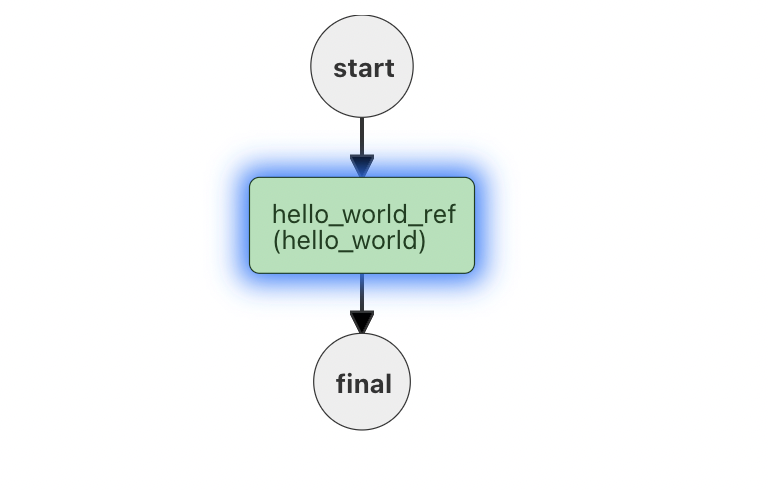
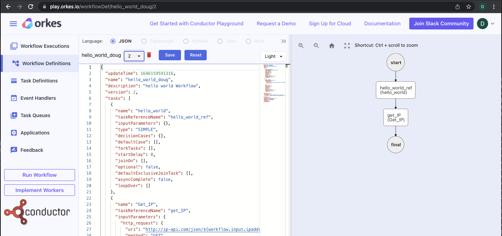
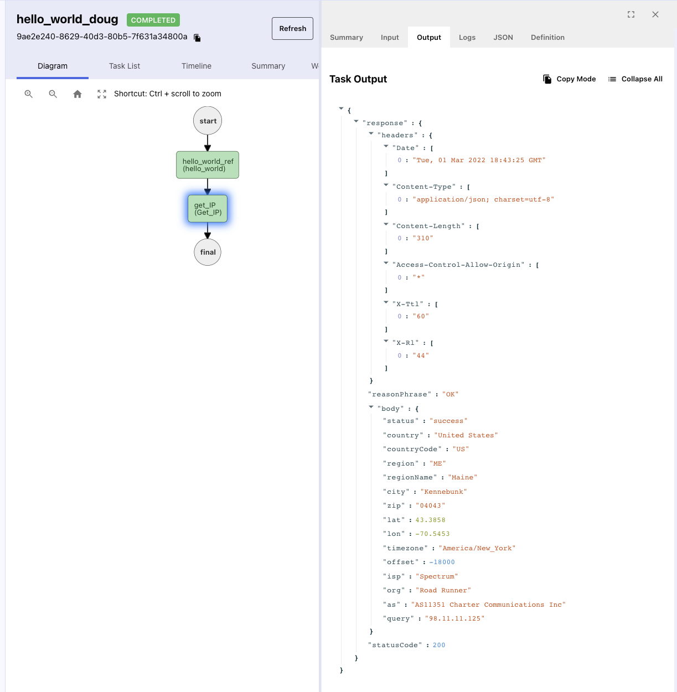

# Hello World Codelab 
## Part 2

[Hello World Part 1](./helloworld)

In this code lab, we'll start with a simple "Hello World" application, but will extend our "Hello World" in order to several new Conductor tasks into our workflow.

In [Part 1](./helloworld), we built a simple workflow with a Java worker.  It simply output the text "Hello World!"



In this section, we'll extend the workflow, adding another task to personalize our workflow.

**Topics Covered**
* Workflow versioning
* HTTP task


## Improving on "Hello World"

The initial workflow was very simple, so in this version of Hello World, we'll use the users' IP to determine their location (and thus their time zone and current time).

Since all web requests include the requestor's IP, it can be assumed that the workflow will include the users IP address. We will add another task to make an API call to get the user's location from their IP address.

## The HTTP Task

Conductor has several System Tasks that can be run on the COnductor server,a nd do not need separate worker applications to complete the task. The HTTP Task is one of these.  We can use this task to ping [https://ip-api.com/](https://ip-api.com/) and get the required information.

This task is added to the workflow.

```
{
  "name": "hello_world_<uniqueId>",
  "description": "hello world Workflow",
  "version": 2,
  "tasks": [
    {
      "name": "hello_world_<uniqueid>",
      "taskReferenceName": "hello_world_ref",
      "inputParameters": {},
      "type": "SIMPLE",
      "decisionCases": {},
      "defaultCase": [],
      "forkTasks": [],
      "startDelay": 0,
      "joinOn": [],
      "optional": false,
      "defaultExclusiveJoinTask": [],
      "asyncComplete": false,
      "loopOver": []
    },
    {
    "name": "Get_IP",
    "taskReferenceName": "get_IP",
    "inputParameters": {
        "http_request": {
        "uri": "http://ip-api.com/json/${workflow.input.ipaddress}?fields=status,message,country,countryCode,region,regionName,city,zip,lat,lon,timezone,offset,isp,org,as,query",
        "method": "GET"
        }
    },
    "type": "HTTP"
    }

  ],
  "outputParameters": {

    "hw_response": "${hello_world_ref.output.hw_response}",
    "hw_location": "We hope the weather is nice near ${get_IP.output.response.body.city}"

  },
  "schemaVersion": 2,
  "restartable": true,
  "workflowStatusListenerEnabled": true,
  "ownerEmail": "devrel@orkes.io",
  "timeoutPolicy": "ALERT_ONLY",
  "timeoutSeconds": 0,
  "variables": {},
  "inputTemplate": {}
}
```

The ```get_IP``` task sends a GET request to the url - with the users' IP address as part of the query string.

The response comes back with details about this IP address.  We'll use the output of this API call to return a the city name:

 ```   "hw_location": "We hope the weather is nice near ${get_IP.output.response.body.city}"```

When this change is made to the workflow, we now have two versions, which can be seen both in the URL path and as a dropdown next to the workflow name:



## Running the new workflow

Clicking the Run Workflow button - you'll now have two options for the version. Let's pick version 2, and in the input add:

```
{"ipaddress":"<your IP address>"}
```

> You can find your IP address by Googling "What's my IP address?"

Click run workflow, and click on the workflowId.  If either of the tasks are blue, click the refresh until they are green:


If you click the ```Workflow Input/Output``` tab, you should see something similar to:

```
{
"ipaddress":"98.11.11.125"
}
Output

{
"hw_location":"We hope the weather is nice near Kennebunk"
"hw_response":"Hello World!"
}
```

you can see the input IP address, and the location is Kennebunk.  If you wanted to see all the details of the Get_IP response, return to the ```Diagram``` tab, and click get_IP in the diagram. In the task Output tab, we can see the details of the API response:



We'll use more of these details as we continue through the code lab.

## Next Steps

We've completed part 2 of the codelab.

In [Part 1](helloworld), we created a workflow using the Netflix Conductor in the Orkes Playground

In Part 2, we extended the workflow using versioning, and added a HTTP Task.

In [Part 3](helloworld3), we'll investigate using FORK tasks in your Workflow. Are you ready to continue? Let's go! [On to Part 3](helloworld3)

