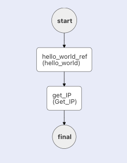

# Hello World Codelab 

## Parts 1-2

What we've covered so far:

[Hello World Part 1](./helloworld) We created the Hello World Workflow.

[Hello World Part 2](./helloworld2)  We created V2 of Hello World (Versioning) and added a HTTP Task.

## Part 3

In Hello World Part 3, we'll introduce the [Fork](/content/docs/reference-docs/fork-task) and [Join](/content/docs/reference-docs/join-task) tasks to break our workflow into parallel tracks that run asynchronously, and then combine back into a single workflow.

## Where we stand

At the end of Part 2, our workflow appears as:



Now, these two tasks are very simple, and do not take long to run, but what if each of these workflows took several seconds to complete?  The workflow would take the sum of their execution times to complete.

Neither of these tasks are dependant on one another, and can run independently. In this section, we'll introduce the Fork & Join tasks that allows us to run independent tasks in parallel.


## Fork and Join

The Fork ann Join tasks run on the Conductor server, and thus do not require a special task definition.

Inside the Fork task, each parallel set of tasks is defined as an array attribute.

Since ```hello_world``` and ```get_IP``` are independent, we can place them in separate parallel forks in version 3 of our workflow.

```
{
  "name": "hello_world_<uniqueId>",
  "description": "hello world Workflow",
  "version": 3,
  "tasks": [
    {"name":"hello_world_fork",
     "taskReferenceName":"hw_fork_ref",
     "type":"FORK_JOIN",
     "forkTasks":[
         [
           {
                "name": "hello_world_<uniqueid>",
                "taskReferenceName": "hello_world_ref",
                "inputParameters": {},
                "type": "SIMPLE",
                "decisionCases": {},
                "defaultCase": [],
                "forkTasks": [],
                "startDelay": 0,
                "joinOn": [],
                "optional": false,
                "defaultExclusiveJoinTask": [],
                "asyncComplete": false,
                "loopOver": []
            }     

         ],[
            {
                "name": "Get_IP",
                "taskReferenceName": "get_IP",
                "inputParameters": {
                    "http_request": {
                    "uri": "http://ip-api.com/json/${workflow.input.ipaddress}?fields=status,message,country,countryCode,region,regionName,city,zip,lat,lon,timezone,offset,isp,org,as,query",
                    "method": "GET"
                    }
                },
            "type": "HTTP"
            }
         ]
     ]},
     {
        "name": "hello_world_join",
        "taskReferenceName": "hw_join_ref",
        "type": "JOIN",
        "joinOn": [
        "get_IP",
        "hello_world_ref"
        ]

     }

  ],
  "outputParameters": {

    "hw_response": "${hello_world_ref.output.hw_response}",
    "hw_location": "We hope the weather is nice near ${get_IP.output.response.body.city}"

  },
  "schemaVersion": 2,
  "restartable": true,
  "workflowStatusListenerEnabled": true,
  "ownerEmail": "devrel@orkes.io",
  "timeoutPolicy": "ALERT_ONLY",
  "timeoutSeconds": 0,
  "variables": {},
  "inputTemplate": {}
}

```

## Joining back

The JOIN task tells the workflow that when the tasks indicated are completed, the workflow can continue on.  In this case, we are waiting for ```get_IP``` and ```hello_world_ref```. Once they are completed, the workflow can move ahead.


When this version of the workflow is submitted, we have a new diagram showing the power of the FORK task:


## Running Version 3

You can now run the workflow version 3 with similar input. Since we didn't change the output, you should get the same response.

We'll leave running the workflow to the user to complete (but it is identical to part 2 if you get stuck).

## Next Steps

We've completed part 3 of the codelab.

In [Part 1](helloworld), we created a workflow using the Netflix Conductor in the Orkes Playground

In [Part 2](helloworld2), we extended the workflow using versioning, and added a HTTP Task.

In Part 3, we created parallel workflows using the FORK task.

In Part 4, we'll extend one of the forks and add an [Inline Task](content/docs/reference-docs/system-tasks/inline-task).  Ready to go? [On to Part 4!](helloworld4)
