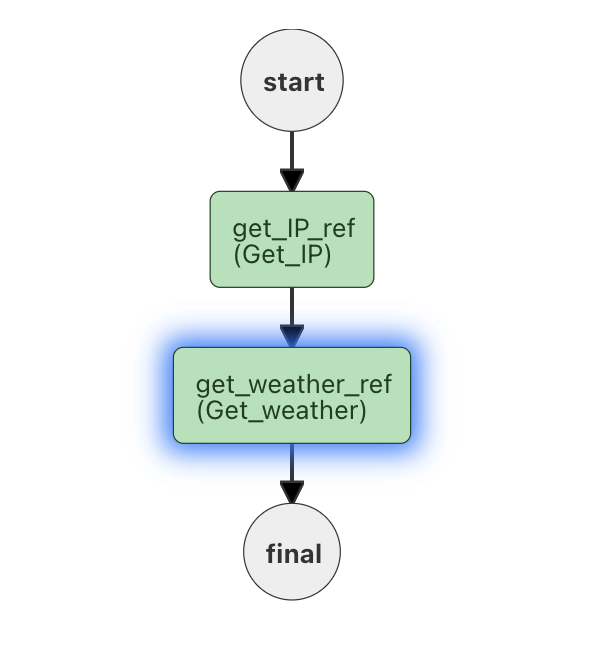

# Utilizing HTTP Tasks

## Introduction

In this code lab, we'll use 2 sequential HTTP tasks, where the first task provides information that is required for the 2nd task to complete.

This code lab is based on a [Stack Overflow question](https://stackoverflow.com/questions/71370237/java-design-pattern-orchestration-workflow/71385718#71385718) on the same topic.

## Sequential tasks

It is a very common occurrence that microservices rely on data from microservices "upstream."  In this code lab, we'll build a workflow with 2 HTTP Tasks.

### Why HTTP Tasks?

HTTP Tasks are run locally on the Conductor server, and do not require a worker to be run for the workflow to complete.  By using simple HTTP Tasks, this workflow can be completely self contained and run on any instance of Conductor with no coding at all.

## What you need

You'll need a version of Conductor.  The images will be based on the [Conductor Playground](https://play.orkes.io), but a [local Conductor instance](/content/docs/getting-started/install/running-locally) works as well.

## What we are building

There are 2 HTTP Tasks in our code:

* **get_IP**:  This uses the supplied IP address (from the workflow input) to get details about the IP address.
* **get_weather**: Uses the zip code provided by the get_IP output to find the current weather locations for the area the IP address is from.

The second task can only run with input provided from the first task.



## Workflow input

The workflow is given an IP address:

```json
{
    "ipaddress": "76.179.66.17" 
}
```

## get_IP

the get_IP task is a HTTP task (and since it is a System task - it only needs to be defined in the workflow):  The IP address is inserted into the URL as ```${workflow.input.ipaddress}```

```json
{
      "name": "Get_IP",
      "taskReferenceName": "get_IP_ref",
      "inputParameters": {
        "http_request": {
          "uri": "http://ip-api.com/json/${workflow.input.ipaddress}?fields=status,message,country,countryCode,region,regionName,city,zip,lat,lon,timezone,offset,isp,org,as,query",
          "method": "GET"
        }
      },
      "type": "HTTP",
      "decisionCases": {},
      "defaultCase": [],
      "forkTasks": [],
      "startDelay": 0,
      "joinOn": [],
      "optional": false,
      "defaultExclusiveJoinTask": [],
      "asyncComplete": false,
      "loopOver": [],
      "retryCount": 3
    }
```

One of the parameters of this API call is a ```zip``` that reports a zipcode related to the IP address which also appears as an output to the task:

```${get_IP_ref.output.response.body.zip}```

We can use this as an input in the second task

## get_weather

The ```get_weather``` HTTP task is very similar to the ```get_IP``` in that it calls a 3rd party API to get results.  In this case, the API takes in a zip code *note this may make the workflow US only* and outputs the current weather conditions:

```json
{
      "name": "Get_weather",
      "taskReferenceName": "get_weather_ref",
      "inputParameters": {
        "zip_code": "${get_IP_ref.output.response.body.zip}",
        "http_request": {
          "uri": "https://weatherdbi.herokuapp.com/data/weather/${get_IP_ref.output.response.body.zip}",
          "method": "GET",
          "connectionTimeOut": 3000,
          "readTimeOut": 3000
        }
      },
      "type": "HTTP",
      "decisionCases": {},
      "defaultCase": [],
      "forkTasks": [],
      "startDelay": 0,
      "joinOn": [],
      "optional": false,
      "defaultExclusiveJoinTask": [],
      "asyncComplete": false,
      "loopOver": []
    }

```


This API comes back with lots of weather information for the zip code.  We only want to share the zip code and the current conditions, we reference these 2 parameters from the 2 task outputs:

```json
  "outputParameters": {
    "zipcode": "${get_IP_ref.output.response.body.zip}",
    "forecast": "${get_weather_ref.output.response.body.currentConditions.comment}"
  }
```

##  Slow API call

The weather API is a heroku app.  It is really very slow.  If you look at the ```http_request```, we have added 2 parameters related to timeout.  We allow this API to ake 3 seconds to reply.  Using the built in values leads to errors, as the API is slow. (While slow, it is also free, and also requires no API key, so - tradeoffs).

The HTTP request system task does not have retry parameters, but we can create another task (with the same name), and add retry parameters:

```json
{
  "createTime": 1646667682201,
  "updateTime": 1646676973253,
  "createdBy": "",
  "updatedBy": "",
  "name": "Get_weather",
  "description": "Edit or extend this sample task. Set the task name to get started",
  "retryCount": 3,
  "timeoutSeconds": 5,
  "inputKeys": [],
  "outputKeys": [],
  "timeoutPolicy": "TIME_OUT_WF",
  "retryLogic": "FIXED",
  "retryDelaySeconds": 5,
  "responseTimeoutSeconds": 5,
  "inputTemplate": {},
  "rateLimitPerFrequency": 0,
  "rateLimitFrequencyInSeconds": 1,
  "backoffScaleFactor": 1
}
```

This tells Conductor to add a ```retryCount: 3```, with a ```"retryDelaySeconds": 5,``` between each attempt.  if the timeout is lowered in the HTTP connection (say to 1500ms), this task will run 4 times (once and then 3 retries), and hopefully one will work - otherwise the workflow will fail after 4 tries.


##  Conclusion

In ths codelab, we used 2 sequential HTTP tasks