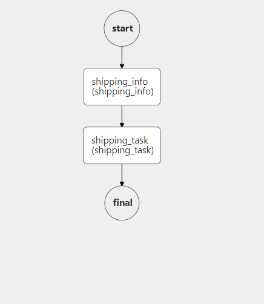
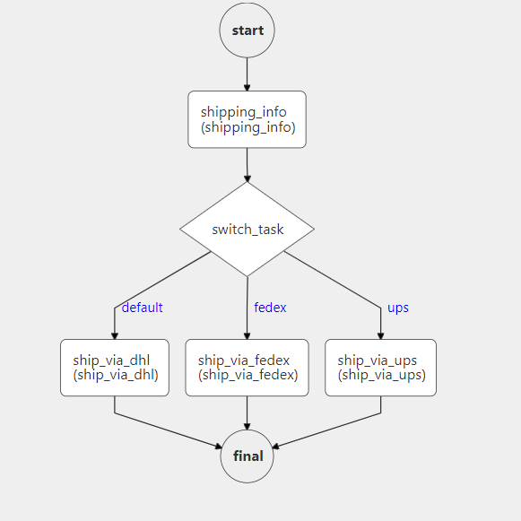
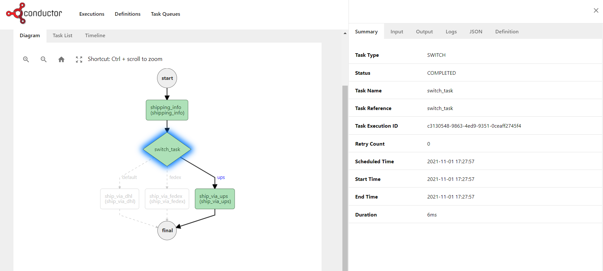

# Workflows

## What are Workflows?
At a high level, a workflow is the Conductor primitive that encompasses the definition and flow of your business logic. It is through a workflow definition that you specify what are the [Tasks](tasks-and-workers.md) that you want Conductor to execute, the ordering of execution flows across these Tasks and how results from different Tasks should be combined together to give you the final result. This orchestration of Tasks can happen a hybrid ecosystem that includes micro services, serverless functions, monolithic applications that spans public cloud and on-premise datacenter footprints. 

One key benefit of this approach is that you can build a complex application using simple and granular tasks that do not need to be aware of or keep track of the state of your application's execution flow. Conductor will keep track of that, calls tasks in the right order (sequentially or parallelly, as defined by you), retry calls if needed, handle failure scenarios gracefully and outputs the final result. 

Leveraging workflows in Conductor enables developers to truly focus on their core mission - building their application code in the languages of their choice. Conductor meanwhile does the heavy lifting associated with ensuring high reliability, transactional consistency and long durability of their workflows. Simply put, wherever your application's component lives and whichever languages they were written in, you can build a workflow in Conductor to orchestrate their execution in a reliable & scalable manner.

## How does a Workflow look like?
Lets start with a  basic workflow and understand what are the different aspects of it. In particular, we will talk about two stages of a workflow, *defining* a workflow and *executing* a workflow
### *Simple Workflow Example*
Assume your business logic is to simply to get some shipping information and then do the shipping. You start by logically partitioning them into two tasks
* **shipping_info** 
* **shipping_task** 

The next step is to [create a workflow in Conductor using JSON](../../running-workflows/create-workflow.md) and then [create the associated tasks in Conductor](../../running-workflows/create-task.md) for the above identified ones. 

After that, you [add those tasks into the workflow](../../running-workflows/adding-tasks.md) to have **shipping_info** called fist and then, if it is successful, call **shipping_task**. You now have a *definition* of the workflow in Conductor and Conductor will then generate an easy to understand visual representation  of this workflow

### *Multiple Paths Workflow Example*

Next lets see a more complex example where you want to support multiple shipping vendors (e.g. FedEx, DHL, UPS) and the code for each of them ive in separate services. This is a good design pattern to follow since you can now independtly change each of them without having to worry about breaking others. Usually this means you now have to take on the work of wiring up many different services into your primary execution path. But with Conductor, this just means adding a [switch operator](../../reference-docs/switch-task.md) to decide which vendor to call depending on an incoming parameter, and then during execution time the right one will be called! 

Furthermore, with Conductor, in addition to the above design view of the workflow, you can also see the execution view of the workflow. In this particular example, the workflow picked UPS at runtime and as seen from the green color of the tasks in the execution path, this workflow completed successfully. If a particular task had failed, it would be show in red.

> ### The Power of Seeing
> These  visual representations of workflows are key to how Conductor turbocharges the productivity of engineering teams. 
> * Workflows definitions serve as the enduring documentation for all the different applications a team owns and this benefit becomes even more powerful as the team scales in size and scope. Furthermore, it allows anyone new to the team to quickly get ramped up . 
> * The execution visualization allows you to quickly identify problem areas and provides you details on the error responses received, details on where the failing task was executing etc. This makes debugging much faster than digging across distributed logs and events amking Conductor's approach to workflows relevant not only during the creation time but also during live operations of the workflows in production

## How do I use Workflows?

### *Starting Workflows*
Once a workflow is defined in Conductor, it is ready to be invoked. An invocation executes the workflow and passes in any arguments that were provided by the caller. There are three ways in which a workflow can be invoked.
* [Calling the Conductor API via REST or gRPC](../../running-workflows/execute-workflow.md#Start-a-workflow-by-calling-an-API). An example of how to do this is also in the [running workflows](../run/running-first-workflow.md#Running-our-First-Workflow) article
* [Posting an event to a queue that Conductor is listening to for incoming workflow invocation requests](../../running-workflows/execute-workflow.md#Start-a-workflow-by-posting-an-event)
* [Scheduling a time at which Conductor should invoke the workflow](../../running-workflows/execute-workflow.md#Schedule-a-workflow-for-later)

### *View Workflows*
Once a workflow is invoked, it starts running and you can [view details of its execution status](../../how-tos/view-workflow-executions.md) 

### *Update Workflows*

When your application's business logic evolves or you need to fix an error in your workflow definition, you can [udpate your workflows](../../how-tos/updating-workflows.md) in Conductor with built-in support for versioning.

> ### The Power of Versioning
> Conductor's native support for versioning allows developers to rapidly iterate on new features even with multiple invocations of the same workflow are in-flight. Unlike other platforms where you either need to wait till those in-flight executions finsh or forcefully error them out, with Conductor you can have both versions in-flight at the same time. In addition to increase in developer agility, this also unlocks other benefits
> * Experiment new features for a small subset of users
> * Safely test changes in production while containing any issue's blast raidus to a known value 

## Further Reading
* [Learn more about tasks and workers](tasks-and-workers.md)
* [Learn more about system tasks](system-tasks.md)
* [Learn more about operators](operators.md)
* [Run your first workflow](../run/running-first-workflow.md)

